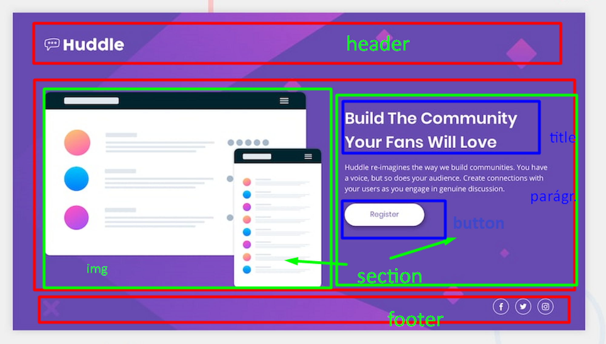

# Projeto Frontend Mentor - Huddle landing page with single introductory section solution

[]

## Tecnologias utilizadas
-HTML
-CSS

## Site Frontend Mentor com o desafio 

(https://www.frontendmentor.io/challenges/huddle-landing-page-with-a-single-introductory-section-B_2Wvxgi0).


### O que eu aprendi
Para começar o projeto, fiz conforme orientações de nossos professores Cadu e Beto, de sempre fazer uma análise antes de iniciar o projeto. Isso facilitou muito para realização do mesmo, porque ao separá-lo em partes, ficou mais fácil de entender qual era o próximo passo.
[]

Para fazer a section do projeto usei display grid na classe container, isso facilitou para dividi-la em duas partes, gostei muito porque nao precisei usar varios códigos

```css
.container{  
display: grid;
grid-template-columns: 1fr 1fr;
}
```

Tive dificuldades para usar os comandos no display flex, mas 
consegui superá-los usando o inspecionar e verificando qual era o alinhamento correto, isso me ajudou bastante.

Acabei usando muito margin e padding para deixar meu design mais alinhado na pagina, ainda estou aprendendo, meu código ficou extenso, principalmente o responsivo, mas estou praticando para melhorar nos próximos.

Tive dificuldade para subir o projeto no github, estava tudo bem nos comando no Git bash here até chegar no git commit,  porque  esqueci de adicionar no git commit -m as pastas, acabei adicionando apenas o index.html. Depois que percebi o erro, consegui adicionar sem problemas.

Esse e meu primeiro readme, me desculpe pelos erros, aceito sugestões

### Desenvolvimento contínuo

Não utilizei no projeto javascript porque ainda estou estudando essa linguagem, estou aprimorando para que os próximos projetos fiquem mais bem executados.

Gostei muito desse projeto, me permititu praticar o display flex e grid, tambem gostei muito de como ficou meu index.html, senti que os códigos ficaram bem escritos, graças as aulas do devquest, senti que não tive muita dificuldade para começar o projeto.

## Author

-Gabriele Jesus-